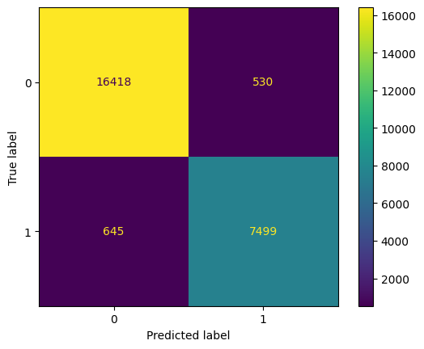
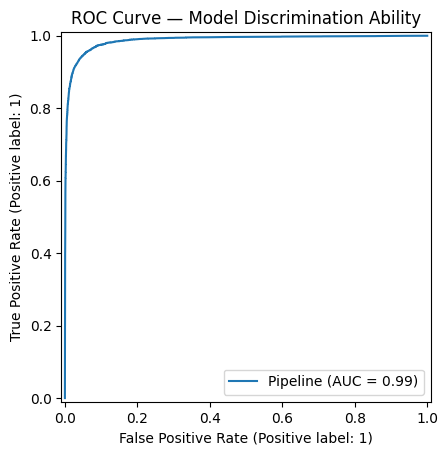
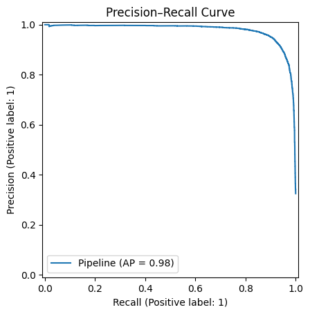
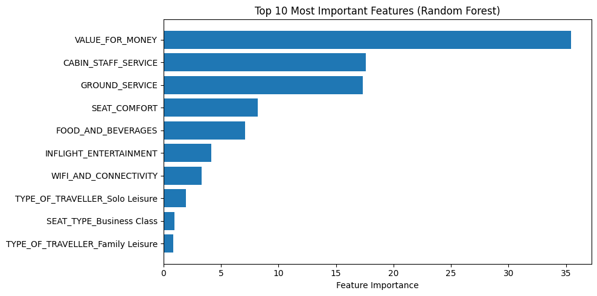

# ✈️ Skytrax Airline Passenger Review Analysis & Recommendation Prediction

## 📖 Overview
This project analyzes **Skytrax airline passenger reviews** to uncover the key factors influencing customer satisfaction and builds **machine learning models** to predict:

1. **Whether a passenger would recommend the airline** *(Classification)*  
2. **The overall rating or perceived value for money** *(Regression — coming soon)*

It combines **data cleaning**, **exploratory data analysis**, and **predictive modeling** in a **modular, reproducible pipeline**.  
The ultimate goal is to help airlines **improve service quality** and **boost customer loyalty** through data-driven insights.

---

## 📊 Project Workflow

### 🧭 1. Data Exploration & Cleaning (`exploration.ipynb`)
- Loaded and cleaned raw airline review data.  
- Handled missing values and inconsistent entries.  
- Conducted **exploratory data analysis (EDA)** to understand distributions and relationships across service dimensions:
  - Seat Comfort  
  - Cabin Staff Service  
  - Food & Beverages  
  - Inflight Entertainment  
  - Value for Money  
- Exported the cleaned dataset for modeling:  
  → `data/cleaned_airline_reviews.csv`

---

### 🧠 2. Classification Modelling — *RECOMMENDED* (`classification.ipynb`)
**Model Question:**  
> *Given their service ratings and travel context, will a passenger recommend the airline?*

**Pipeline:**
- Built preprocessing using `ColumnTransformer`:  
  - Numerical → imputed & standardized  
  - Categorical → imputed & one-hot encoded  
- Models trained & compared:
  - Logistic Regression  
  - Random Forest Classifier  
  - XGBoost Classifier  
  - CatBoost Classifier
  - LightBM
- **Evaluation Metrics:** Accuracy, Precision, Recall, F1-score, ROC AUC, Average Precision  
- Used **5-fold Stratified Cross-Validation** for model robustness.

**Results Summary:**

| Metric | Cross-Validation | Test Set |
|:-------|:----------------:|:--------:|
| Accuracy | 0.953 | 0.953 |
| F1-score | 0.928 | 0.927 |
| ROC AUC | 0.988 | 0.987 |
| Average Precision | 0.978 | 0.977 |

**Best Model:** 🏆 *CatBoost Classifier*  
→ `clf__depth=4`, `clf__iterations=400`

---

### 📈 Key Visualizations
- ✅ **Confusion Matrix** — balanced performance across classes  


- 🧭 **ROC Curve (AUC = 0.99)** — near-perfect discrimination  


- 📊 **Precision–Recall Curve (AP = 0.98)** — strong precision–recall balance  


- 💡 **Feature Importance** — interpretable business insights  


**Top 5 Predictors:**
1. Value for Money  
2. Cabin Staff Service  
3. Ground Service  
4. Seat Comfort  
5. Food & Beverages  

> 💬 *Insight:* Passengers care most about perceived value, staff quality, and comfort.  
> Improving these areas can directly enhance recommendation likelihood.

---

### 📉 3. Regression Modelling — *VALUE_FOR_MONEY* (Upcoming)
**Model Question:**  
> *How much value for money will a passenger perceive given their experience across service dimensions?*

**Planned Models:**
- Linear Regression  
- Random Forest Regressor  
- XGBoost Regressor  
- CatBoost Regressor

**Evaluation Metrics:** RMSE, MAE, R² Score  

**Planned Visualizations:**
- Predicted vs. Actual Ratings  
- Residual Distribution  
- Feature Importance (Regression Context)

---

## 🧩 Project Structure
```plaintext
skytrax_review_ml_pipeline/
│
├── config/
│   ├── cfg.py
│   └── connection.toml
│
├── data/
│   └── cleaned_airline_reviews.csv
│
├── notebooks/
│   ├── exploration.ipynb
│   └── classification.ipynb
│
├── src/
│   ├── __init__.py
│   ├── connection.py
│   ├── data_prep.py
│   ├── train.py
│   ├── predict.py
│
├── tests/
│   └── test_session.py
│
├── venv/
│
├── .gitignore
├── requirements.txt
├── LICENSE
└── README.md
