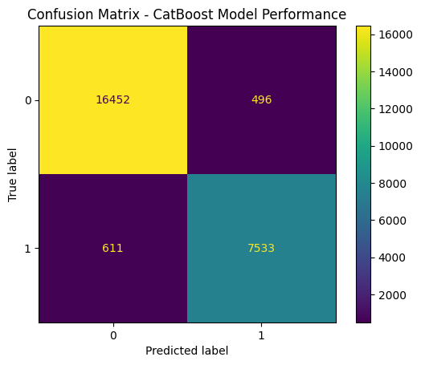
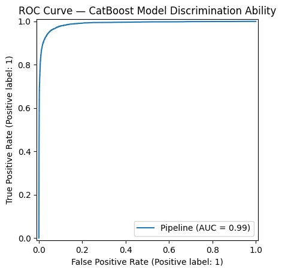
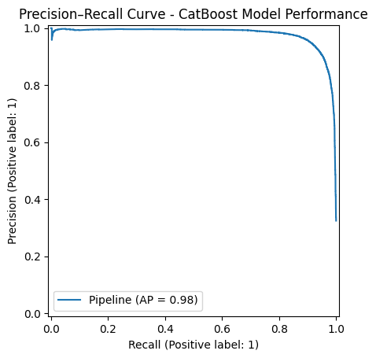
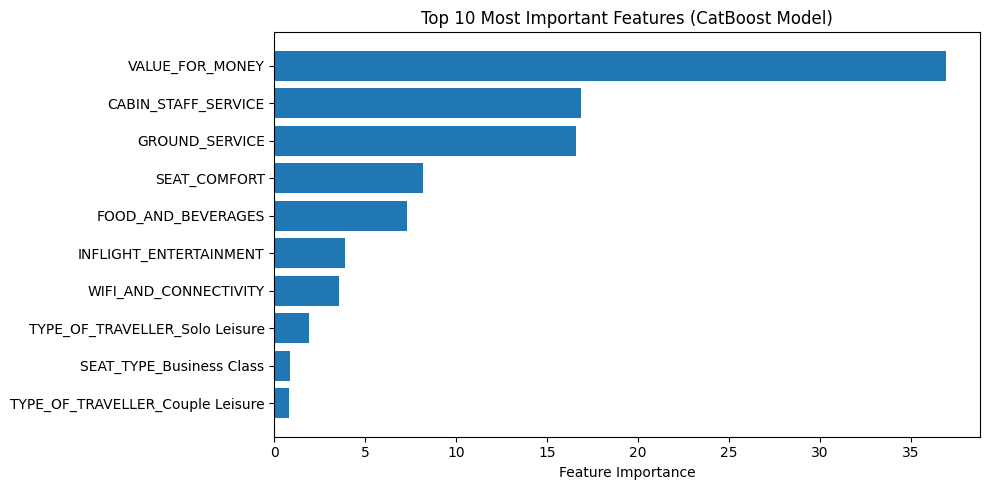

# ✈️ Skytrax Airline Passenger Review Analysis & Recommendation Prediction

## 📖 Overview
This project analyzes **Skytrax airline passenger reviews** to uncover the key factors influencing customer satisfaction and builds **machine learning models** to predict:

1. **Whether a passenger would recommend the airline** *(Classification)*  
2. **The overall rating or perceived value for money** *(Regression — coming soon)*

It combines **data cleaning**, **exploratory data analysis**, and **predictive modeling** in a **modular, reproducible pipeline**.  
The ultimate goal is to help airlines **improve service quality** and **boost customer loyalty** through data-driven insights.

---

## 📊 Project Workflow

### 🧭 1. Data Exploration & Cleaning (`exploration.ipynb`)
- Loaded and cleaned raw airline review data.  
- Handled missing values and inconsistent entries.  
- Conducted **exploratory data analysis (EDA)** to understand distributions and relationships across service dimensions:
  - Seat Comfort  
  - Cabin Staff Service  
  - Food & Beverages  
  - Inflight Entertainment  
  - Value for Money  
- Exported the cleaned dataset for modeling:  
  → `data/cleaned_airline_reviews.csv`

---

### 🧠 2. Classification Modelling — *RECOMMENDED* (`classification.ipynb`)
**Model Question:**  
> *Given their service ratings and travel context, will a passenger recommend the airline?*

**Pipeline:**
- Built preprocessing using `ColumnTransformer`:  
  - Numerical → imputed & standardized  
  - Categorical → imputed & one-hot encoded  
- Models trained & compared:
  - Logistic Regression  
  - Random Forest Classifier  
  - XGBoost Classifier  
  - CatBoost Classifier
  - LightBM
- **Evaluation Metrics:** Accuracy, Precision, Recall, F1-score, ROC AUC, Average Precision  
- Used **5-fold Stratified Cross-Validation** for model robustness.

**Results Summary:**

| Metric | Cross-Validation | Test Set |
|:-------|:----------------:|:--------:|
| Accuracy | 0.953 | 0.953 |
| F1-score | 0.928 | 0.927 |
| ROC AUC | 0.988 | 0.987 |
| Average Precision | 0.978 | 0.977 |

**Best Model:** 🏆 *CatBoost Classifier*  
→ `clf__depth=4`, `clf__iterations=400`

---

### 📈 Key Visualizations
- ✅ **Confusion Matrix** — balanced performance across classes  


- 🧭 **ROC Curve (AUC = 0.99)** — near-perfect discrimination  


- 📊 **Precision–Recall Curve (AP = 0.98)** — strong precision–recall balance  


- 💡 **Feature Importance** — interpretable business insights  


**Top 5 Predictors:**
1. Value for Money  
2. Cabin Staff Service  
3. Ground Service  
4. Seat Comfort  
5. Food & Beverages  

> 💬 *Insight:* Passengers care most about perceived value, staff quality, and comfort.  
> Improving these areas can directly enhance recommendation likelihood.

---

## 📉 3. Regression Modelling — *VALUE_FOR_MONEY* (`regression.ipynb`)

**Model Question:**

> *How much value for money will a passenger perceive given their experience across service dimensions?*

**Pipeline:**
- Built preprocessing using `ColumnTransformer`:  
  - Numerical → imputed (constant=0) & standardized  
  - Categorical → imputed (most_frequent) & one-hot encoded  
- Models trained & compared:
  - Linear Regression  
  - Ridge Regression
  - Random Forest Regressor  
  - XGBoost Regressor  
- **Evaluation Metrics:** RMSE, MAE, R², MAPE  
- Used **5-fold Cross-Validation** for model robustness.

**Results Summary:**

| Metric | Cross-Validation | Test Set |
|:-------|:----------------:|:--------:|
| R² | 0.7710 | 0.7700 |
| RMSE | 0.7620 | 0.7616 |
| MAE | 0.5179 | 0.5179 |
| MAPE | - | 0.2789 |

**Best Model:** 🏆 *XGBoost Regressor*  
→ `max_depth=5`, `learning_rate=0.1`, `n_estimators=200`

---

### 📈 Key Visualizations

- 📊 **Model Performance Analysis** — strong predictive accuracy and unbiased predictions  
<p align="center">
  
  <br>
  <em>Predicted vs Actual (R² = 0.77), Residual Plot, and Residual Distribution.</em>
</p>

**Model Performance:**
- Strong predictive accuracy (R² ≈ 0.77) with most points clustered near diagonal
- Residuals centered around zero → unbiased predictions
- Near-normal distribution of residuals → statistically sound model
- Homoscedasticity confirmed → constant variance across predicted values

---

- 💡 **Feature Importance** — interpretable business insights  
<p align="center">
  
  <br>
  <em>Top predictors for VALUE_FOR_MONEY perception.</em>
</p>

**Top 5 Predictors:**
1. Cabin Staff Service (47%)
2. Ground Service (31%)
3. Seat Comfort (11%)
4. Food & Beverages (4.2%)
5. Solo Leisure Traveler (2.9%)

> 💬 *Insight:* **Human service consistency (staff + ground = 78%)** drives perceived value more than premium amenities (WiFi, entertainment <1% each).  
> Focus resources on staff training and ground operations for maximum ROI.
---

## 🧩 Project Structure
```plaintext
skytrax_review_ml_pipeline/
│
├── config/
│   ├── cfg.py
│   └── connection.toml
│
├── data/
│   └── cleaned_airline_reviews.csv
│
├── notebooks/
│   ├── exploration.ipynb
│   └── classification.ipynb
│
├── src/
│   ├── __init__.py
│   ├── connection.py
│   ├── data_prep.py
│   ├── train.py
│   ├── predict.py
│
├── tests/
│   └── test_session.py
│
├── venv/
│
├── .gitignore
├── requirements.txt
├── LICENSE
└── README.md
